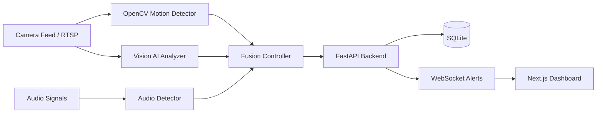
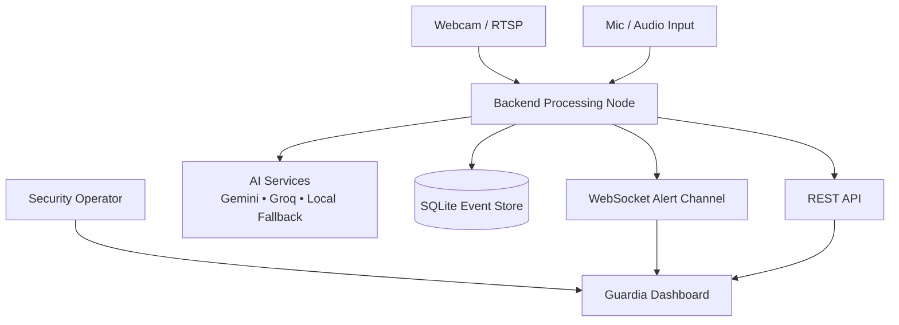
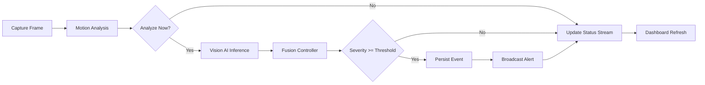
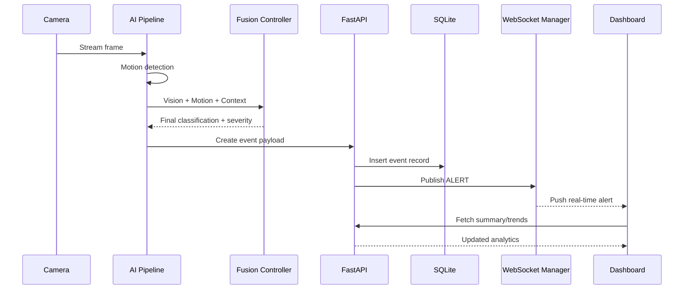
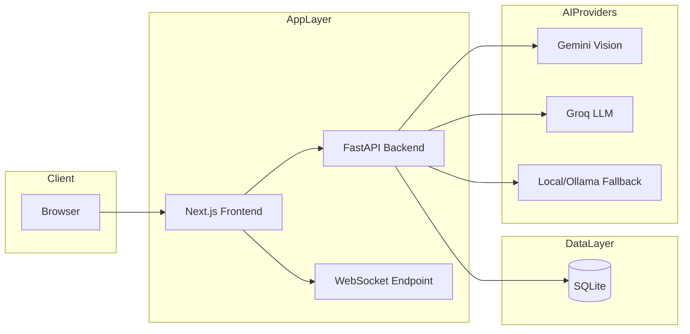
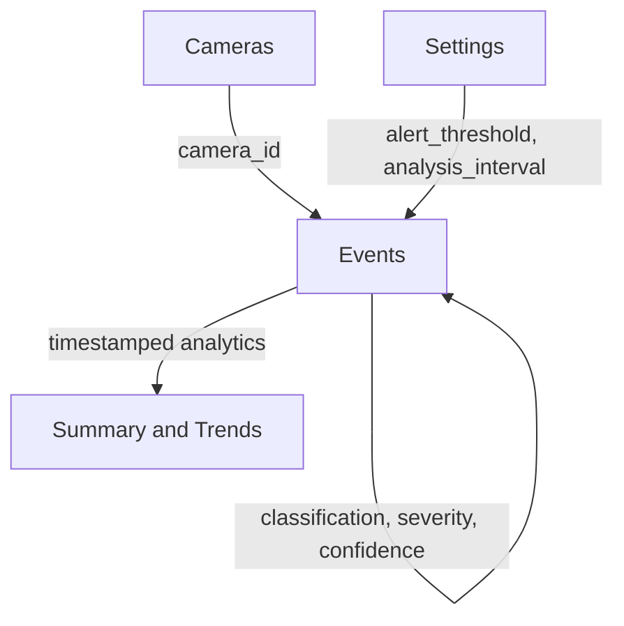

# Guardia AI

<p align="center">
  
</p>

<p align="center">
  <a href="#quick-start"></a>
  <a href="#system-architecture"></a>
  <a href="#api-highlights"></a>
  <a href="#architecture-and-flow-suite"></a>
</p>

<p align="center">
  
  
  
  
  
  
</p>

<p align="center">
  <a href="LICENSE"></a>
  <a href="CONTRIBUTING.md"></a>
</p>

---

## Premium Snapshot

<p align="center">
  <table>
    <tr>
      <td align="center"><strong>Detection Pipeline</strong><br />Motion + Vision + Fusion</td>
      <td align="center"><strong>Real-Time UX</strong><br />WebSocket-driven live alerts</td>
      <td align="center"><strong>Storage Layer</strong><br />SQLite event logging</td>
      <td align="center"><strong>Deployment Target</strong><br />Backend + Dashboard ready</td>
    </tr>
  </table>
</p>

<p align="center">
  
  
  
  
</p>

---

## What Is Guardia AI?
Guardia AI is a real-time multimodal surveillance MVP that turns live camera feeds into actionable security alerts.

It combines:
- Computer vision motion analysis
- AI vision reasoning
- LLM-based fusion logic
- Real-time alert broadcasting
- Dashboard-first monitoring workflow

The goal is to help operators detect and prioritize incidents faster by generating severity-scored alerts with context.

---

## Module Shields

### Backend Module
<p>
  
  
  
  
</p>

### AI Module
<p>
  
  
  
</p>

### Frontend Module (Planned Structure)
<p>
  
  
  
</p>

---

## System Architecture


---

## Architecture and Flow Suite

### 1) High-Level Context Diagram


### 2) Runtime Processing Flow


### 3) Alert Lifecycle Sequence


### 4) Deployment Topology


### 5) Data Model Relationship View


---

## API Highlights
Base URL:
```bash
http://localhost:8000
```

Important routes:
- GET /api/v1/status
- GET /api/v1/events
- GET /api/v1/events/recent
- PATCH /api/v1/events/{event_id}/review
- GET /api/v1/cameras
- POST /api/v1/cameras
- GET /api/v1/cameras/{camera_id}/snapshot
- GET /api/v1/analytics/summary
- GET /api/v1/analytics/trends
- GET /api/v1/settings
- POST /api/v1/settings
- POST /api/v1/settings/test-connection
- WS /ws/alerts

Quick health test:
```bash
curl http://localhost:8000/api/v1/status
```

---

<details>
  <summary><strong>Quick Start</strong></summary>

### 1) Clone
```bash
git clone https://github.com/codernotme/guardia-ai.git
cd guardia-ai
```

### 2) Create and Activate Virtual Environment (Windows PowerShell)
```powershell
python -m venv .venv
.\.venv\Scripts\Activate.ps1
```

### 3) Install Dependencies
If you create a backend requirements file from the SDLC plan:
```powershell
pip install -r backend/requirements.txt
```

### 4) Configure Environment
Create .env with keys:
```env
GEMINI_API_KEY=
GROQ_API_KEY=
HUGGINGFACE_API_KEY=
ALERT_THRESHOLD=5
ANALYSIS_INTERVAL_FRAMES=30
DATABASE_URL=sqlite:///./guardia.db
```

### 5) Run Backend
```powershell
python backend/main.py
```

### 6) Run Frontend
```powershell
cd frontend
npm install
npm run dev
```

</details>

---

<details>
  <summary><strong>Current Repository Snapshot</strong></summary>

This repository currently includes:
- Complete product and engineering blueprint in GUARDIA_AI_SDLC.md
- Backend schema models in backend_schemas.py
- Extra backend API route modules in backend_api_extras.py

The SDLC document also defines the intended backend/frontend folder structure, contracts, and implementation plan.

</details>

---

<details>
  <summary><strong>Roadmap and Delivery Status</strong></summary>

- [x] Product requirements and architecture drafted
- [x] API contracts documented
- [x] Core schemas defined
- [x] Supplemental backend routes drafted
- [ ] End-to-end backend package finalized in repository tree
- [ ] Frontend package finalized in repository tree
- [ ] Deployment and public demo URLs

</details>

---

<details>
  <summary><strong>Feature Highlights</strong></summary>

| Capability | What It Does | Benefit |
|---|---|---|
| Motion Detection | Detects scene activity from video frames | Triggers fast anomaly checks |
| Vision AI Analysis | Classifies scene threats and confidence | Adds semantic understanding |
| Fusion Controller | Combines motion, vision, and context | Produces final severity and action hints |
| Real-Time Alerts | Streams events over WebSocket | Enables instant operator response |
| Event Logging | Stores incidents in SQLite | Supports audits and analytics |
| Dashboard UX | Live feed, alerts, analytics, settings | End-to-end operator workflow |

</details>

---

## Repository Map
- GUARDIA_AI_SDLC.md: Full agile package, architecture, contracts, implementation blueprint
- backend_schemas.py: Pydantic request/response schemas
- backend_api_extras.py: Additional API route modules for settings and cameras
- CONTRIBUTING.md: Contribution workflow and standards
- LICENSE: MIT license terms

---

## Team
- Aryan Bajpai: Scrum Master, Backend AI Lead
- Omisha Singh: Frontend Lead
- Kartikey Mishra: AI Models and Fusion Logic
- Ayushman Dwivedi: DevOps, Database, Backend API

---

## Contributing
Read CONTRIBUTING.md for setup, branch naming, commit style, pull request checklist, and review expectations.

---

## License
This project is licensed under the MIT License. See LICENSE for full text.
